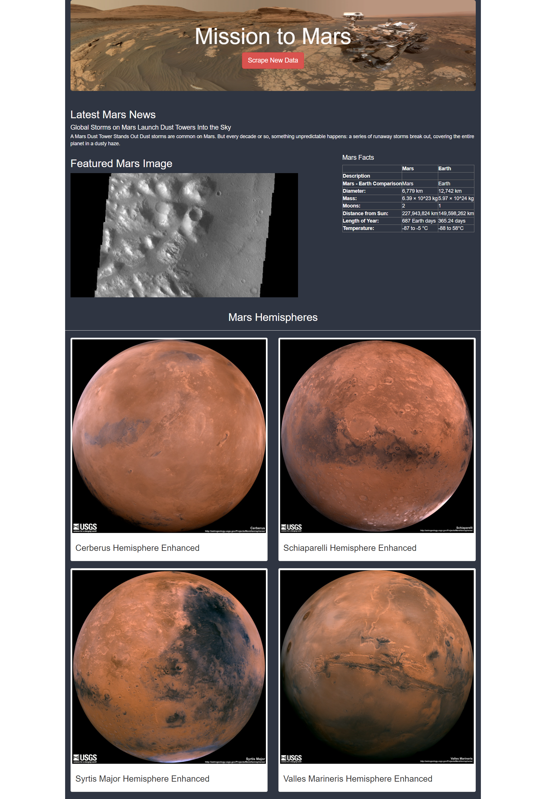

# Mission to Mars
## Project Overview

The purpose of this project was to use the python libraries `splinter` and `BeautifulSoup` to scrape web page data from various websites related to the discoveries and images of the planet Mars. Once the scraping script `scraping.py` was constructed, the `Flask` app (`app.py`) was used to update a MongoDB that holds the scraped data and display it using Bootstrap 3.3.7 components in the `index.html`.

## Results

### Web App Screenshot


### Code Snippets
### *scraping.py*
```python
# Import dependencies
from splinter import Browser
from bs4 import BeautifulSoup as soup
import pandas as pd
import datetime as dt
from webdriver_manager.chrome import ChromeDriverManager
import scraping

def scrape_all():
    # Initiate headless driver for deployment
    executable_path = {'executable_path': ChromeDriverManager().install()}
    browser = Browser('chrome', **executable_path, headless=True)

    #News title and paragraph scraping
    news_title, news_paragraph = mars_news(browser)

    # Run all scraping functions and store results in a dictionary
    data = {
        "news_title": news_title,
        "news_paragraph": news_paragraph,
        "featured_image": featured_image(browser),
        "facts": mars_facts(),
        "last_modified": dt.datetime.now(),
        "hemispheres": mars_hemispheres(browser)
    }

    # Stop webdriver and return data
    browser.quit()
    return data

#---------------------------------------------------------------------------------------------------#
#MWMWMWMWMWMWMWMWMWMWMWMWMWMWMWMWMWMWMWMWMWMWMWMWMWMWMWMWMWMWMWMWMWMWMWMWMWMWMWMWMWMWMWMWMWMWMWMWMWMW
#---------------------------------------------------------------------------------------------------#
# News artical scraping function
#===================================================================================================#

def mars_news(browser):

    url = 'https://redplanetscience.com/'
    browser.visit(url)

    # Optional delay for loading the page
    browser.is_element_present_by_css('div.list_text', wait_time=1)

    # Convert the browser html to a soup object and then quit the browser
    html = browser.html
    news_soup = soup(html, 'html.parser')

# Add try/except for error handling
    try:
        slide_elem = news_soup.select_one('div.list_text')
        # Use the parent element to find the first 'a' tag and save it as 'news_title'
        news_title = slide_elem.find('div', class_='content_title').get_text()
        # Use the parent element to find the paragraph text
        news_p = slide_elem.find('div', class_='article_teaser_body').get_text()

    except AttributeError:
        return None, None

    
    return news_title, news_p

#---------------------------------------------------------------------------------------------------#
#MWMWMWMWMWMWMWMWMWMWMWMWMWMWMWMWMWMWMWMWMWMWMWMWMWMWMWMWMWMWMWMWMWMWMWMWMWMWMWMWMWMWMWMWMWMWMWMWMWMW
#---------------------------------------------------------------------------------------------------#
# JPL Space Images Featured Image
#===================================================================================================#

def featured_image(browser):
    # Visit URL
    url = 'https://spaceimages-mars.com'
    browser.visit(url)

    # Find and click the full image button
    full_image_elem = browser.find_by_tag('button')[1]
    full_image_elem.click()

    # Parse the resulting html with soup
    html = browser.html
    img_soup = soup(html, 'html.parser')

    # Add try/except for error handling
    try:
        # Find the relative image url
        img_url_rel = img_soup.find('img', class_='fancybox-image').get('src')

    except AttributeError:
        return None

    # Use the base url to create an absolute url
    img_url = f'https://spaceimages-mars.com/{img_url_rel}'

    return img_url

#---------------------------------------------------------------------------------------------------#
#MWMWMWMWMWMWMWMWMWMWMWMWMWMWMWMWMWMWMWMWMWMWMWMWMWMWMWMWMWMWMWMWMWMWMWMWMWMWMWMWMWMWMWMWMWMWMWMWMWMW
#---------------------------------------------------------------------------------------------------#
# Mars Facts
#===================================================================================================#

def mars_facts():
    # Add try/except for error handling
    try:
        # Use 'read_html' to scrape the facts table into a dataframe
        df = pd.read_html('https://galaxyfacts-mars.com')[0]

    except BaseException:
        return None

    # Assign columns and set index of dataframe
    df.columns=['Description', 'Mars', 'Earth']
    df.set_index('Description', inplace=True)

    # Convert dataframe into HTML format, add bootstrap
    return df.to_html()


#---------------------------------------------------------------------------------------------------#
#MWMWMWMWMWMWMWMWMWMWMWMWMWMWMWMWMWMWMWMWMWMWMWMWMWMWMWMWMWMWMWMWMWMWMWMWMWMWMWMWMWMWMWMWMWMWMWMWMWMW
#---------------------------------------------------------------------------------------------------#
# Mars Hemisphere image scrape
#===================================================================================================#

def mars_hemispheres(browser):
    anchor_list = [4, 6, 8, 10]
    # 2. Create a list to hold the images and titles.
    hemisphere_image_urls = []
    for anchor in anchor_list:
        # 1. Use browser to visit the URL 
        url = 'https://marshemispheres.com/'
        browser.visit(url)
        full_image_elem = browser.find_by_tag('a')[anchor]
        full_image_elem.click()

        # 3. Write code to retrieve the image urls and titles for each hemisphere.
        # Parse the resulting html with soup
        html = browser.html
        img_soup = soup(html, 'html.parser')
        img_soup
        title = img_soup.find('h2', class_='title').get_text()
        img_url_rel = img_soup.find('img', class_='wide-image').get('src')
        img_url = f'https://marshemispheres.com/{img_url_rel}'
        
        hemisphere = {'img_url':img_url, 'title':title}
        hemisphere_image_urls.append(hemisphere)
    
    return hemisphere_image_urls

    
if __name__ == "__main__":
    # If running as script, print scraped data
    print(scrape_all())

```

### *app.py*

```python
from flask import Flask, render_template, redirect, url_for
from flask_pymongo import PyMongo
import scraping

app = Flask(__name__)

# Use flask_pymongo to set up mongo connection
app.config["MONGO_URI"] = "mongodb://localhost:27017/mars_app"
mongo = PyMongo(app)

#Set up routes
@app.route("/")
def index():
   mars = mongo.db.mars.find_one()
   return render_template("index.html", mars=mars)

@app.route("/scrape")
def scrape():
   mars = mongo.db.mars
   mars_data = scraping.scrape_all()
   mars.update_one({}, {"$set":mars_data}, upsert=True)
   return redirect('/', code=302)

if __name__ == "__main__":
    app.run(debug=True)

```

### *index.html*

```html
<!DOCTYPE html>
<html lang="en">
  <head>
    <meta charset="UTF-8" />
    <meta name="viewport" content="width=device-width, initial-scale=1.0" />
    <meta http-equiv="X-UA-Compatible" content="ie=edge" />
    <title>Mission to Mars</title>
    <link
      rel="stylesheet"
      href="https://maxcdn.bootstrapcdn.com/bootstrap/3.3.7/css/bootstrap.min.css"
    />
    <link rel="stylesheet" href="static/css/style.css">

  </head>
  <body>
    <div class="container bg-dark">
      <!-- Add Jumbotron to Header -->
      <div class="jumbotron text-center">
        <h1>Mission to Mars</h1>
        <!-- Add a button to activate scraping script -->
        <p><a class="btn btn-primary btn-lg btn-danger" href="/scrape" role="button">Scrape New Data</a></p>
      </div>

      <!-- Add section for Mars News -->
      <div class="row" id="mars-news">
        <div class="col-md-12">
          <div class="media">
            <div class="media-body">
              <h2>Latest Mars News</h2>
              <h4 class="media-heading">{{ mars.news_title }}</h4>
              <p>{{ mars.news_paragraph }}</p>
            </div>
          </div>
        </div>
      </div>

      <!-- Section for Featured Image and Facts table -->
      <div class="row" id="mars-featured-image">
        <div class="col-md-8">
          <h2>Featured Mars Image</h2>

          <!-- if images is False/None/non-existent, then default to error message -->
          
        </div>

        <div class="col-md-4">
          <!-- Mars Facts -->
          <div class="row" id="mars-facts">
            <h4>Mars Facts</h4>
            {{ mars.facts | safe }}
          </div>
        </div>
      </div>

      <!-- Section for Mars Hemispheres -->
      <div class="row" id="mars-hemispheres">
        <div class="page-header">
          <h2 class="text-center">Mars Hemispheres</h2>
        </div>

        
        <div class="col-md-6">
          <div class="thumbnail">
            
            <div class="caption">
              <h3>{{hemisphere.title}}</h3>
            </div>
          </div>
        </div>
        
      </div>
    </div>
  </body>
</html>

```
